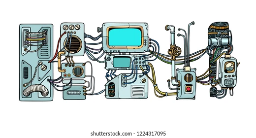

# Unresponsive SME article

*Good communication within the team is the second most important thing in technical writing.*

Technical writers put together instruction manuals, user guides, frequently asked questions, and easy-to-read journal articles. But that’s only the tip of the iceberg. Among a technical writer's typical duties and responsibilities, one special aspect involves a technical writer working directly with technical specialists. In this case, the ideal technical writer must have strong communication skills. That’s right!  Good communication within the team is the second most important thing in technical writing.

Most technical writers work for professional, scientific, and technical services. Some work for manufacturers, administrative and support services, and publishing companies. In each case, a technical writer who creates documentation interview subject matter expert (SME) when they need more information about the product that they will describe. 

## Role of SME

Some simple methods may help to save some time when it comes to dealing with unresponsiveness of SME’s.

But, who is an SME?

A subject-matter expert (SME) is also known as a domain expert. It’s an individual with special skills or a deep understanding of a particular job or topic. An SME might be a software engineer, a helpdesk support operative, an accounts manager, a scientific researcher: in short, anybody with in-depth knowledge of the subject can become a subject-matter expert. 

An SME is considered an authority on a certain topic – not only educated on the subject but has the capacity to share their knowledge with other interested parties, in our case with technical writers.

However, many SMEs may not have time to provide constant feedback or may struggle to prioritize feedback due to a heavy workload or lack of time. 

A very good communication practice might be crucial, and that’s the thing most people either never heard or simply don’t care about.

## How to handle with unresponsive SME

*Some simple methods may help to save some time when it comes to dealing with unresponsiveness of SME’s.*

Send email with clear statement -  Rather avoid the complicated elaborations about the problem. Also, avoiding a high number of acronyms will make your request more understandable for SME. Always make sure that your statement is clear. If you still struggling with getting answer, try to send a gentle reminder. 

Call over the email - Especially efficient for simple message. This way of communication building relationships. It also allows to clarify complex materials less likely to be misinterpreted.

Set-up the deadline - suggest the date that is suitable for you and ask whether it’s suitable for them or not. Moreover, describe some points that you’re going to discuss, it will help SMEs estimate how much time your meeting will take.

Raise the issue among the wider group of Experts - There are upsides and downsides to making decisions in a group. The main risks include falling into groupthink that will distort the process. But bringing more minds together to solve a problem has its advantages. It may increase the chances the SME will land on a successful solution faster.

## Final conclusions

*Good communication is the key to success.*

Good communication is the key to success. Try to be more proactive with getting all necessary information from SME. Don’t just send an email and wait for reply, because you may never get it! Also, don’t forget to show respect to SME’s and to any co-workers from your team. This will help you archive the desired results.
